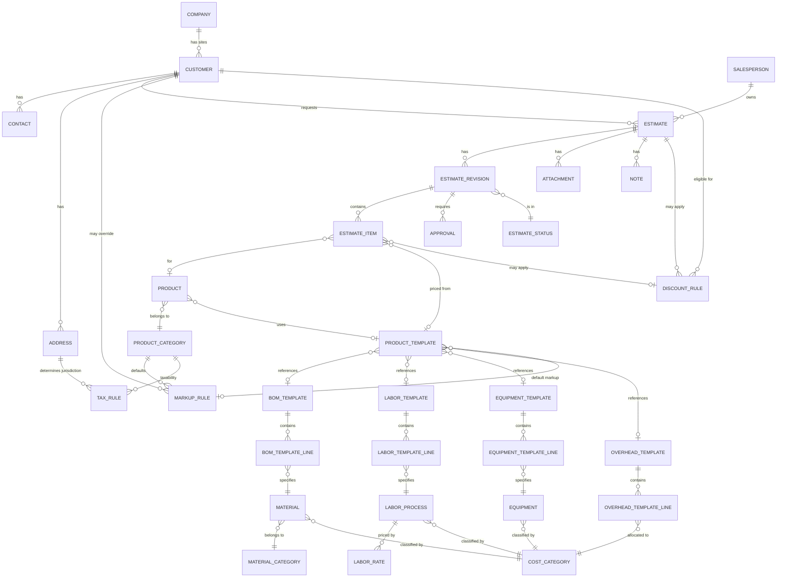
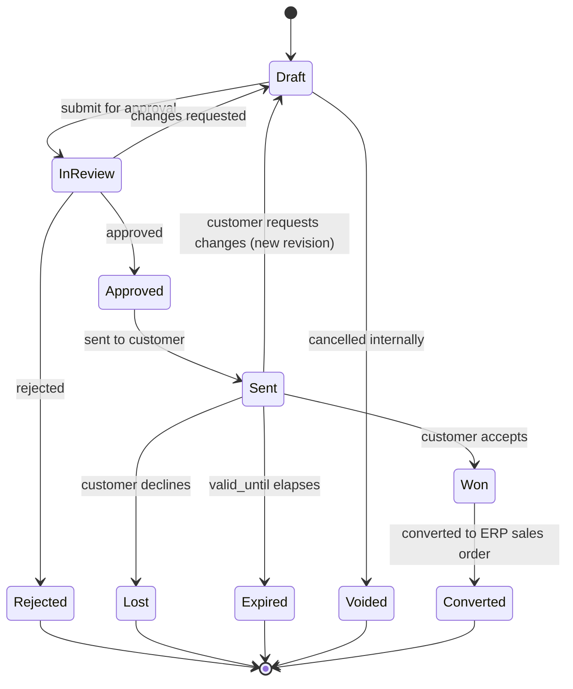

# Domain Model

Phase 0.5 deliverable — business domain design for the AMC Sales
Estimating System, prior to any feature implementation. This is the
architecture gate for Phase 1.

No database tables or application code exist yet for this domain. This
document is the source of truth that [DATABASE_DESIGN.md](./DATABASE_DESIGN.md)
will be built from once implementation starts.

## Contents

1. [Domain Model](#1-domain-model)
2. [Entity Relationship Diagram](#2-entity-relationship-diagram)
3. [Business Rules](#3-business-rules)
4. [Numbering Standards](#4-numbering-standards)
5. [Future ERP Integration](#5-future-erp-integration)
6. [Recommendations](#6-recommendations)

---

## 1. Domain Model

### 1.1 Key architectural decision: centralized Cost Library

Rather than a flat model where an Estimate Item points straight at a
Product, the domain is built around a **Cost Library**: a set of
reusable, independently-maintained costing entities that a **Product
Template** composes together. Estimate Items reference a Product
Template (when one exists) and pull a **cost snapshot** from it at the
time the line is created or revised.

```
Customer
   │
   ▼
Estimate → Estimate Revision → Estimate Item
                                     │
                                     ▼
                              Product Template
                                     │
                    ┌────────────┬───────────┬─────────────┬───────────────┐
                    ▼            ▼           ▼             ▼               ▼
              BOM Template  Labor Template  Equipment    Overhead     Pricing Rules
                                             Template     Template   (Markup/Discount/Tax)
```

**Why snapshot instead of live-reference only:** if Estimate Items
always resolved cost live from the Cost Library, a price change to a
Material next year would silently rewrite the economics of a quote from
last year. Estimate Items store a resolved cost snapshot (see
[§3.5](#35-cost-snapshot-vs-live-cost-library)) _and_ keep a reference
back to the Cost Library records used, so historical estimates stay
accurate while new estimates always pull current costs. This is what
makes historical pricing and margin analysis (a stated goal) possible.

This also directly sets up the two other stated goals: **purchasing
integration** (Material and BOM Template become the shared vocabulary
between estimating and a future purchasing/MRP module) and **inventory
integration** (Material as a distinct, centrally-priced entity is a
prerequisite for stock-aware costing).

### 1.2 Entity catalog

Entities are grouped by role. "New" marks entities added beyond your
original list to make the Cost Library concept concrete — see
[§6 Recommendations](#6-recommendations) for the reasoning on each.

#### Party / CRM entities

| Entity          | Purpose                                                                                                                                          | Key attributes                                                      | Key relationships                                                      |
| --------------- | ------------------------------------------------------------------------------------------------------------------------------------------------ | ------------------------------------------------------------------- | ---------------------------------------------------------------------- |
| **Company**     | Top-level organization a Customer may roll up to (e.g. a corporate parent with multiple purchasing sites). Enables multi-site reporting/rollups. | name, industry, website                                             | has many Customers                                                     |
| **Customer**    | The transactional party an Estimate is created for — the actual bill-to/ship-to account.                                                         | customer_number, name, status, payment_terms, company_id (nullable) | belongs to Company (optional); has many Contacts, Addresses, Estimates |
| **Contact**     | A person at a Customer (buyer, engineer, AP contact).                                                                                            | name, title, email, phone, is_primary                               | belongs to Customer                                                    |
| **Address**     | A billing or shipping location for a Customer.                                                                                                   | line1/2, city, state, postal_code, country, type (billing/shipping) | belongs to Customer; referenced by Tax Rule resolution                 |
| **Salesperson** | Internal user who owns/creates Estimates.                                                                                                        | employee_code, name, email, region, commission_rate                 | owns many Estimates; is a system User (see §6)                         |

#### Estimating entities

| Entity                | Purpose                                                                                                                        | Key attributes                                                                                                                                                | Key relationships                                                                               |
| --------------------- | ------------------------------------------------------------------------------------------------------------------------------ | ------------------------------------------------------------------------------------------------------------------------------------------------------------- | ----------------------------------------------------------------------------------------------- |
| **Estimate**          | The parent quote record — one per customer ask. Number stays fixed across revisions.                                           | estimate_number, customer_id, salesperson_id, title, currency, valid_until                                                                                    | belongs to Customer, Salesperson; has many Estimate Revisions, Attachments, Notes               |
| **Estimate Revision** | An immutable-once-superseded version of the estimate's line items and pricing. Exactly one revision is "current" per Estimate. | revision_number, estimate_id, status_id, created_by, superseded_at                                                                                            | belongs to Estimate; has many Estimate Items; has many Approvals; has one Estimate Status       |
| **Estimate Item**     | A single priced line on a revision.                                                                                            | line_number, product_id (nullable), product_template_id (nullable), description, quantity, uom, cost snapshot fields, markup/discount applied, extended_price | belongs to Estimate Revision; references Product / Product Template; has a Cost Snapshot (§3.5) |
| **Estimate Status**   | Lookup of valid lifecycle states + the state machine metadata (see [§3.1](#31-estimate-lifecycle)).                            | code, label, is_terminal, allowed_next_states                                                                                                                 | referenced by Estimate Revision                                                                 |
| **Approval**          | A single approval/rejection decision on a revision (see [§3.3](#33-approval-workflow)).                                        | estimate_revision_id, approver_id, decision, threshold_reason, decided_at, comment                                                                            | belongs to Estimate Revision                                                                    |
| **Attachment**        | A file (drawing, spec sheet, customer PO) attached to an Estimate or Estimate Item.                                            | file_url, filename, uploaded_by, attached_to (polymorphic: Estimate / Estimate Item)                                                                          | belongs to Estimate or Estimate Item                                                            |
| **Note**              | A free-text note/comment thread entry.                                                                                         | body, author_id, attached_to (polymorphic), created_at                                                                                                        | belongs to Estimate, Estimate Revision, or Estimate Item                                        |

#### Product entities

| Entity               | Purpose                                                                                                                                                       | Key attributes                                                                                                                                      | Key relationships                                                                                                |
| -------------------- | ------------------------------------------------------------------------------------------------------------------------------------------------------------- | --------------------------------------------------------------------------------------------------------------------------------------------------- | ---------------------------------------------------------------------------------------------------------------- |
| **Product**          | A sellable thing that can appear on an estimate — may or may not have a Product Template behind it.                                                           | product_number, name, product_category_id, product_template_id (nullable)                                                                           | belongs to Product Category; optionally uses one Product Template                                                |
| **Product Category** | Grouping for Products (and default Markup Rule / Tax Rule attachment point).                                                                                  | code, name, parent_category_id (nullable, for hierarchy)                                                                                            | has many Products; default Markup Rule / Tax Rule target                                                         |
| **Product Template** | The composition root of the Cost Library for a configurable product — "recipe" that ties together BOM, labor, equipment, overhead, and default pricing rules. | template_number, name, product_category_id, bom_template_id, labor_template_id, equipment_template_id, overhead_template_id, default_markup_rule_id | references BOM/Labor/Equipment/Overhead Template + Markup Rule; used by Product and/or directly by Estimate Item |

#### Cost Library entities

| Entity                                       | Purpose                                                                                                                                         | Key attributes                                                                                        | Key relationships                                                          |
| -------------------------------------------- | ----------------------------------------------------------------------------------------------------------------------------------------------- | ----------------------------------------------------------------------------------------------------- | -------------------------------------------------------------------------- |
| **Material**                                 | A purchasable input costed into BOMs.                                                                                                           | material_number, name, material_category_id, uom, current_unit_cost, cost_category_id                 | belongs to Material Category and Cost Category; used in BOM Template Lines |
| **Material Category**                        | Grouping for Materials (e.g. Steel, Fasteners, Electrical) — also a pricing-hierarchy fallback level.                                           | code, name, default_unit_cost (fallback)                                                              | has many Materials                                                         |
| **BOM Template**                             | A reusable bill of materials — the "recipe" of Materials for a Product Template.                                                                | template_number, name, revision, is_active                                                            | has many BOM Template Lines; used by Product Template(s)                   |
| _BOM Template Line_ (detail of BOM Template) | One Material + quantity + scrap% within a BOM Template.                                                                                         | material_id, quantity, uom, scrap_percent                                                             | belongs to BOM Template; references Material                               |
| **Labor Process**                            | A discrete unit of labor work (e.g. "CNC Setup," "Weld — MIG").                                                                                 | code, name, cost_category_id, default_labor_rate_id                                                   | belongs to Cost Category; has a default Labor Rate                         |
| **Labor Rate**                               | An effective-dated cost-per-hour for a Labor Process (or a role/category, for fallback).                                                        | labor_process_id (nullable for category-level rates), rate_per_hour, effective_date, expires_date     | belongs to Labor Process (or Cost Category, for fallback rates)            |
| _Labor Template_ **(new)**                   | A reusable "recipe" of Labor Processes + standard hours for a Product Template — the labor analogue of BOM Template.                            | template_number, name, is_active                                                                      | has many Labor Template Lines; used by Product Template(s)                 |
| _Labor Template Line_ (detail, **new**)      | One Labor Process + standard hours within a Labor Template.                                                                                     | labor_process_id, standard_hours                                                                      | belongs to Labor Template; references Labor Process                        |
| **Equipment**                                | A machine/asset whose usage is costed into a job (e.g. "Laser Cutter #2").                                                                      | equipment_number, name, cost_category_id, rate_per_hour                                               | belongs to Cost Category                                                   |
| _Equipment Template_ (detail-group, **new**) | A reusable "recipe" of Equipment + standard hours for a Product Template.                                                                       | template_number, name, is_active                                                                      | has many Equipment Template Lines; used by Product Template(s)             |
| _Equipment Template Line_ (detail, **new**)  | One Equipment + standard hours within an Equipment Template.                                                                                    | equipment_id, standard_hours                                                                          | belongs to Equipment Template; references Equipment                        |
| _Overhead Template_ **(new)**                | A reusable overhead allocation method for a Product Template (e.g. "15% of labor," "$X/unit").                                                  | template_number, name, is_active                                                                      | has many Overhead Template Lines; used by Product Template(s)              |
| _Overhead Template Line_ (detail, **new**)   | One overhead allocation rule: a Cost Category + method + rate.                                                                                  | cost_category_id, allocation_method (percent_of_labor / percent_of_direct_cost / flat_per_unit), rate | belongs to Overhead Template; references Cost Category                     |
| **Cost Category**                            | Cross-cutting classification of any cost (material/labor/equipment/overhead) — used for rollup reporting and, later, GL account mapping in ERP. | code, name, cost_type (material/labor/equipment/overhead)                                             | referenced by Material, Labor Process, Equipment, Overhead Template Line   |

#### Pricing & rules entities

| Entity            | Purpose                                                                                                                                                                                             | Key attributes                                                                                        | Key relationships                                          |
| ----------------- | --------------------------------------------------------------------------------------------------------------------------------------------------------------------------------------------------- | ----------------------------------------------------------------------------------------------------- | ---------------------------------------------------------- |
| **Markup Rule**   | Defines markup % (or fixed margin target) applied over direct cost. Attachable at Product Category, Product Template, or Customer level (most-specific wins — see [§3.6](#36-margin-calculations)). | scope (category/template/customer), scope_id, markup_percent or target_margin_percent, effective_date | referenced by Product Category, Product Template, Customer |
| **Discount Rule** | Defines a discount (% or flat) applicable to a Customer, an Estimate, or a volume threshold.                                                                                                        | scope, scope_id, discount_percent or discount_amount, min_quantity (nullable)                         | referenced by Customer, Estimate, Estimate Item            |
| **Tax Rule**      | Defines a tax rate applicable based on ship-to Address (jurisdiction) and Product Category taxability.                                                                                              | jurisdiction (state/region), rate_percent, product_category_id (nullable = applies to all)            | referenced by Address (jurisdiction), Product Category     |

### 1.3 Cost snapshot (implicit entity)

Every Estimate Item stores a **resolved cost snapshot** at the moment
it's created or re-priced on a revision: total material cost, total
labor cost, total equipment cost, total overhead cost, the markup/
discount/tax actually applied, and references to the Cost Library
record IDs used to compute it. This is not a separately user-facing
entity, but it is a real table (`estimate_item_cost_snapshot` or
columns directly on Estimate Item) — see [§3.5](#35-cost-snapshot-vs-live-cost-library).

---

## 2. Entity Relationship Diagram



---

## 3. Business Rules

### 3.1 Estimate lifecycle



`Estimate Status` is tracked per **Estimate Revision**, not per Estimate
— the Estimate itself has no status of its own; its "current state" is
simply its current revision's state.

### 3.2 Revision workflow

- An Estimate always has ≥1 Revision. Revision 1 is created with the
  Estimate.
- Exactly one Revision is **current** at a time (`is_current` flag or
  "highest revision_number not yet superseded").
- A Revision becomes immutable once it moves out of `Draft` (submitted
  for approval or beyond). Any further change creates a **new**
  Revision, copying forward the prior Revision's items as a starting
  point.
- Superseding a Revision sets `superseded_at`; the new Revision starts
  in `Draft`.
- Estimate Number (`EST-2026-000001`) never changes across revisions;
  only the revision suffix does (`-R02`).

### 3.3 Approval workflow

- Approval is required to move a Revision from `Draft` → `InReview` →
  `Approved`.
- Approval is **threshold-based**: a Revision requires approval if
  margin % falls below a configured floor, or total value exceeds a
  configured ceiling (both configurable, not hardcoded — see
  Recommendations for a `System Setting`/`Approval Threshold` entity).
- Multiple `Approval` records can exist per Revision (multi-level: e.g.
  sales manager, then finance, above a higher threshold). A Revision is
  `Approved` only once all required Approval records are `approved`; a
  single `rejected` decision moves the Revision to `Rejected`.
- Approvals are immutable once recorded (a changed mind requires a new
  Revision + new approval cycle).

### 3.4 Status transitions

| From     | To                   | Trigger                                 | Guard                                    |
| -------- | -------------------- | --------------------------------------- | ---------------------------------------- |
| Draft    | InReview             | Salesperson submits                     | All required fields populated            |
| InReview | Draft                | Reviewer requests changes               | —                                        |
| InReview | Approved             | All required Approvals recorded         | No pending/rejected approvals            |
| InReview | Rejected             | Any required Approval rejects           | Terminal for this revision               |
| Approved | Sent                 | Salesperson marks sent to customer      | —                                        |
| Sent     | Won / Lost / Expired | Outcome recorded / `valid_until` passes | Terminal (Won may continue to Converted) |
| Sent     | Draft (new revision) | Customer requests changes               | Creates new Revision per §3.2            |
| Won      | Converted            | ERP sales order created                 | Standalone → ERP boundary (§5)           |
| Draft    | Voided               | Internal cancellation                   | Terminal                                 |

### 3.5 Cost snapshot vs. live Cost Library

- **Cost Library records (Material, Labor Rate, Equipment, templates)
  are live** — they get updated over time as costs change.
- **Estimate Items snapshot resolved costs** at creation/re-price time:
  material/labor/equipment/overhead cost totals, the markup/discount/
  tax actually applied, and the Cost Library record IDs + effective
  dates used.
- Re-pricing a Draft Revision against current Cost Library values is an
  explicit user action ("Refresh Pricing"), never automatic — so a
  Draft doesn't silently drift while someone is working on it, and a
  Sent/Won estimate never drifts at all.

### 3.6 Margin calculations

```
Total Direct Cost   = Material Cost + Labor Cost + Equipment Cost + Overhead Cost
Material Cost       = Σ (BOM line qty × resolved material unit cost × (1 + scrap%))
Labor Cost          = Σ (Labor template line standard hours × resolved labor rate)
Equipment Cost      = Σ (Equipment template line standard hours × equipment rate)
Overhead Cost       = per Overhead Template line method:
                         percent_of_labor      → rate% × Labor Cost
                         percent_of_direct_cost → rate% × (Material + Labor + Equipment)
                         flat_per_unit          → rate × quantity

List Price          = Total Direct Cost × (1 + resolved Markup %)
Net Price           = List Price − resolved Discount
Extended Price      = Net Price × Quantity

Estimate Subtotal   = Σ Extended Price (all items on the current Revision)
Tax                 = Subtotal × resolved Tax Rule rate (where taxable)
Estimate Total      = Subtotal + Tax

Margin %  = (Net Price − Total Direct Cost) / Net Price      ← for reporting/approval thresholds
Markup %  = (Net Price − Total Direct Cost) / Total Direct Cost
```

Margin % and Markup % are **not the same number** and both should be
displayed — conflating them is a common source of pricing errors.

### 3.7 Material pricing hierarchy

Most specific wins; first match resolves:

1. Manual override entered directly on the Estimate Item
2. Customer-specific negotiated price (future `Customer Pricing
Agreement` entity — see §6)
3. Material's current effective-dated unit cost
4. Material Category default unit cost (coarse fallback, e.g. pricing
   a not-yet-cataloged material by category average)
5. Resolution failure → line is blocked from leaving `Draft` until
   priced manually

### 3.8 Labor costing hierarchy

Most specific wins; first match resolves:

1. Manual override entered directly on the Estimate Item
2. Customer-specific negotiated labor rate (future entity, §6)
3. Labor Process's currently effective Labor Rate
4. Cost Category-level fallback Labor Rate (a Labor Rate with
   `labor_process_id = null`, scoped to a Cost Category)
5. Global default Labor Rate (a single system-wide fallback)

---

## 4. Numbering Standards

| Entity                                             | Format             | Example                 | Notes                                                              |
| -------------------------------------------------- | ------------------ | ----------------------- | ------------------------------------------------------------------ |
| Estimate                                           | `EST-YYYY-NNNNNN`  | `EST-2026-000001`       | Sequence resets each calendar year                                 |
| Estimate Revision                                  | `<estimate #>-RNN` | `EST-2026-000001-R02`   | Appended to parent; not a standalone sequence                      |
| Company                                            | `COM-NNNNNN`       | `COM-000001`            | Global sequence                                                    |
| Customer                                           | `CUS-NNNNNN`       | `CUS-000001`            | Global sequence, independent of Company                            |
| Product                                            | `PRD-NNNNNN`       | `PRD-000001`            | Global sequence                                                    |
| Product Template                                   | `PRT-NNNNNN`       | `PRT-000001`            | Global sequence                                                    |
| Material                                           | `MAT-NNNNNN`       | `MAT-000001`            | Global sequence                                                    |
| BOM Template                                       | `BOM-NNNNNN`       | `BOM-000001`            | Global sequence                                                    |
| Labor Template                                     | `LBT-NNNNNN`       | `LBT-000001`            | Global sequence                                                    |
| Equipment Template                                 | `EQT-NNNNNN`       | `EQT-000001`            | Global sequence                                                    |
| Overhead Template                                  | `OHT-NNNNNN`       | `OHT-000001`            | Global sequence                                                    |
| Labor Process                                      | `LAB-NNNNNN`       | `LAB-000001`            | Global sequence                                                    |
| Equipment                                          | `EQP-NNNNNN`       | `EQP-000001`            | Global sequence                                                    |
| Contact, Address, Attachment, Note, Approval       | —                  | —                       | Internal UUID/PK only; never customer- or user-facing              |
| Product Category, Material Category, Cost Category | short code         | `CAT-STEEL`, `CAT-WELD` | Human-assigned short codes, not sequences                          |
| Markup Rule, Discount Rule, Tax Rule               | —                  | —                       | Internal UUID/PK; referenced by scope, not displayed as a "number" |

All sequences are zero-padded to 6 digits and are **global** (not
per-year) except Estimate, which resets annually as shown. `NNNNNN`
generation must be done via a DB sequence or equivalent — never derived
from `count(*)`, to avoid collisions under concurrent creation.

---

## 5. Future ERP Integration

| Entity             | Ownership                     | Notes                                                                                                                                 |
| ------------------ | ----------------------------- | ------------------------------------------------------------------------------------------------------------------------------------- |
| Company            | Shared with ERP               | Master data; ERP is likely system of record once integrated, synced in                                                                |
| Customer           | Shared with ERP               | Same — estimating may create provisional customers, reconciled against ERP customer master on sync                                    |
| Contact            | Shared with ERP               | Synced alongside Customer                                                                                                             |
| Address            | Shared with ERP               | Synced alongside Customer                                                                                                             |
| Salesperson        | Shared with ERP               | Likely HR/ERP-owned employee master                                                                                                   |
| Estimate           | Standalone                    | Lives entirely in this system until Won                                                                                               |
| Estimate Revision  | Standalone                    | Never leaves estimating                                                                                                               |
| Estimate Item      | Standalone                    | Becomes input to an ERP Sales Order line only at conversion (Won → Converted)                                                         |
| Estimate Status    | Standalone                    | Estimating-specific workflow, not an ERP concept                                                                                      |
| Approval           | Standalone                    | Estimating-specific workflow                                                                                                          |
| Attachment         | Standalone                    | May optionally be copied to ERP on conversion                                                                                         |
| Note               | Standalone                    | Internal to estimating                                                                                                                |
| Product            | Shared with ERP               | ERP item master is likely eventual system of record; estimating may pre-create, reconciled on sync                                    |
| Product Category   | Shared with ERP               | Aligns with ERP item groups for reporting consistency                                                                                 |
| Product Template   | Standalone                    | Estimating-specific configurator concept; not an ERP object                                                                           |
| Material           | Shared with ERP               | ERP item/inventory master is likely eventual system of record for cost + on-hand data                                                 |
| Material Category  | Shared with ERP               | Aligns with ERP item groups                                                                                                           |
| BOM Template       | Standalone → future ERP-owned | Standalone now; once ERP has formal MRP BOMs, this may become ERP-owned with estimating referencing it                                |
| Labor Process      | Standalone → future Shared    | May align with ERP labor routing/operations if ERP has a routing module                                                               |
| Labor Rate         | Standalone                    | Estimating-specific rate card; ERP payroll/costing rates are a separate concern unless explicitly unified later                       |
| Labor Template     | Standalone                    | Estimating-specific composition, no ERP equivalent expected                                                                           |
| Equipment          | Shared with ERP               | Likely aligns with ERP fixed-asset/equipment master                                                                                   |
| Equipment Template | Standalone                    | Estimating-specific composition                                                                                                       |
| Overhead Template  | Standalone                    | Estimating-specific allocation method                                                                                                 |
| Cost Category      | Shared with ERP               | Should map to ERP GL account structure for future financial reporting alignment                                                       |
| Markup Rule        | Standalone                    | Pricing policy owned by estimating/sales                                                                                              |
| Discount Rule      | Standalone                    | Pricing policy owned by estimating/sales                                                                                              |
| Tax Rule           | ERP-owned                     | Tax compliance logic should defer to ERP/tax engine once integrated — do not let estimating become the system of record for tax rates |

**General principle:** anything that is master/reference data about the
business (who the customer is, what a material costs to buy, what
equipment exists) trends toward **Shared**, converging on ERP as system
of record. Anything that is part of the _sales process itself_
(Estimate, Revision, Approval, Notes) stays **Standalone** — that's this
system's actual job. **Tax Rule** is called out as **ERP-owned** rather
than Shared because tax compliance logic changes frequently and
carries legal risk if two systems disagree; estimating should treat it
as authoritative from ERP/a tax engine as soon as that integration
exists, using local Tax Rule records only as a pre-integration stand-in.

---

## 6. Recommendations

Entities/concepts to add before implementation begins, in priority
order:

1. **Unit of Measure (UOM)** — referenced informally above (`uom` on
   Material, BOM Template Line, Estimate Item) but not modeled. Needs
   its own lookup entity with conversion factors (e.g. `EA`, `FT`,
   `LB`, `HR`) — required correctness for any quantity math.
2. **User / Role** — Salesperson is a business role, but every actor in
   the system (salesperson, approver, admin) needs an underlying `User`
   entity tied to Supabase Auth, with a `Role` for permissions
   (who can approve, who can edit Cost Library records, etc.). This is
   foundational for the Approval workflow (§3.3) and for RLS policies
   noted in [ARCHITECTURE.md](./ARCHITECTURE.md).
3. **Customer Pricing Agreement** — referenced as "future entity" in
   both pricing hierarchies (§3.7, §3.8). Needed before those hierarchy
   levels are anything more than a placeholder. Should probably be
   built in the same phase as Material/Labor Rate, not deferred long.
4. **Approval Threshold (System Setting)** — the margin-floor/value-
   ceiling rules that trigger required approval (§3.3) need to live
   somewhere configurable rather than hardcoded; a small settings
   entity (or a dedicated `Approval Threshold` table scoped by Product
   Category/Customer tier) should be added.
5. **Vendor / Supplier** — not needed for Phase 1 estimating, but
   explicitly called out because it's the natural next step for the
   "future purchasing integration" goal — Material should be designed
   knowing a `preferred_vendor_id` / vendor-price-list relationship is
   coming, even if not built yet.
6. **Audit Log** — Approvals and Revisions give you _some_ history, but
   a general-purpose audit trail (who changed what field, when) on
   Cost Library records in particular (Material cost changes, Labor
   Rate changes) is valuable for the "historical pricing" and "margin
   analysis" goals, and is hard to retrofit later. Worth at least a
   lightweight `changed_by`/`changed_at`/`previous_value` pattern on
   effective-dated cost entities from day one.
7. **Currency** — out of scope unless AMC estimates in multiple
   currencies today. Flagging as an open question rather than a
   recommendation to build: confirm single-currency (USD) is correct
   before locking in `currency` as a free-text field vs. a real
   Currency entity.

None of these block starting Phase 1 schema work, but #1 (UOM) and #2
(User/Role) should land **in the same migration batch** as the core
entities above, since Material/BOM quantities and the Approval workflow
are meaningless without them.
